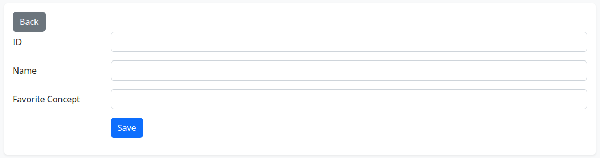

# Nihongogaku App

Nihongogaku app is a Laravel CRUD application for collecting students' favorite Japanese linguistics concepts.

The name 'Nihongogaku' comes from the Japanese romanization of 日本語学 that means 'Japanese linguistics'.

## Table Of Contents

-   [Introduction](#introduction)
-   [ERD](#erd)
-   [Description](#descriptions)
-   [Local Server Installation](#local-server-installation)
-   [Features](#features)
-   [Stack](#stack)

## Introduction

This is an initial attempt at developing a simple Laravel CRUD web application.

The objective is to learn and apply basic web development concepts such MVC.

## ERD


## Descriptions

| **Database** | **Details**                                                            |
| ------------ | ---------------------------------------------------------------------- |
| `students`   | store students' IDs, names, and favorite Japanese linguistics concepts |

## Local Server Installation

-   Clone the repo:

    ```
    $ git clone https://github.com/gulfaniputra/nihongogaku-app.git
    ```

-   Move to the `nihongogaku-app` directory on your local machine:

    ```
    $ cd nihongogaku-app
    ```

-   Copy `.env.example` and rename it as `.env`.

-   Configure the database section in `.env`:

    ```
    ...

    DB_CONNECTION=<my_connection>
    DB_HOST=<my_host>
    DB_PORT=<my_port>
    DB_DATABASE=<my_database>
    DB_USERNAME=<my_username>
    DB_PASSWORD=<my_password>

    ...
    ```

-   Install the app’s dependencies:

    ```
    $ composer install
    $ npm install
    ```

-   Generate the `APP_KEY` in `.env` to a random string:

    ```
    $ php artisan key:generate
    ```

-   Create the migration repository:

    ```
    $ php artisan migrate
    ```

-   Seed the database:

    ```
    $ php artisan db:seed
    ```

-   Start Laravel's local development server:

    ```
    $ php artisan serve
    ```

## Features

-   Dashboard with a 'Search' feature:

    

-   'Add A Student':

    

-   'Edit':

    

## Stack

-   Laravel 10
-   Bootstrap 5
